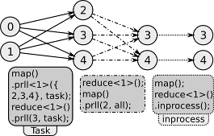

# ezl: easyLambda
> data processing with modern C++ and MPI. Modular, parallel, based on data-flow with map and reduce.

## Long story short

The project started with the need for a standard way to process data with
C++. The design goals are composability, easy interface, decoupling IO,
data-format and parallel code from algorithm logic, less boilerplate code,
accessible to anyone who knows C. easyLambda achieves these goals with type-safe
data-flow pipeline, map/reduce like operations, MPI parallelism; presented with
an easy but powerful
[ExpressionBuilder](http://martinfowler.com/bliki/ExpressionBuilder.html)
interface made possible by use of modern C++ features.

## Why easyLambda

Use ezl for your data-processing tasks, to write post-processors for simulation
results, for iterative machine learning algorithms, for general list data
processing or any data/task parallel code. You get an expressive way to
compose the algorithms as a pipeline of small tasks, clean separation of
various algorithm logics from i/o or parallelism, various built-in
functions for common operations and MPI parallelism with no to little extra
code. It makes your application clean, modular, parallel, expressive and
all the good things in programming practices :). Check the examples listed
below to know some of the ways ezl has been used.

You can use it along with other libraries like openCV/Dlib/thrust that work
well with standard data-types like vector and tuple.

If you are a C++ enthusiast then possibly you will find the project quite
interesting. Contributions and feedback of any kind are much appreciated.
Please check [contributing.md](contributing.md) for more.

## Overview

Here is a short example to begin with. The program calculates
frequency of each word in the data files. Words are considered same
irrespective of their case (upper or lower).

#### [Example wordcount](examples/wordcount.cpp)
```cpp
#include <string>

#include <boost/mpi.hpp>

#include <ezl/ezl.hpp>
#include <ezl/algorithms/readFile.hpp>
#include <ezl/algorithms/reduces.hpp>

int main(int argc, char* argv[]) {
  using std::string;
  using ezl::readFile;
  boost::mpi::environment env(argc, argv);

  ezl::rise(readFile<string>(argv[1]).rowSeparator('s').colSeparator(""))
    .reduce<1>(ezl::count(), 0).dump()
    .run();
  return 0;
}
```
The data-flow starts with `rise` and subsequent operations are added to the
pipeline. In the above example, the pipeline starts with reading data from
file(s). `readFile` is a library function that takes column types and file(s)
glob pattern as input and reads the file(s) in parallel. It has a lot of
properties for controlling data-format, parallelism, denormalization etc
(shown in [demoReadFile](examples/demoReadFile.cpp)).

In reduce we pass the index of the key column, the library function for counting
and initial value of the result. The wordcount example is too simple to show
the library features.

Following is the data-flow for calculating pi using Monte-Carlo method.

#### [Example pi (Monte-Carlo)](examples/pi.cpp)
```cpp
ezl::rise(ezl::kick(10000)) // 10000 trials in total
  .map([] { 
    auto x = rand01();
    auto y = rand01();
    return x*x + y*y; 
  })
  .filter(ezl::lt(1.))
  .reduce(ezl::count(), 0)
  .map([](int inCircleCount) { 
    return (4.0 * inCircleCount / 10000); 
  }).colsTransform().dump()
  .run();
```

The steps in the algorithm have been expressed with the composition of small
operations, some are common library functions like `count()`, `lt()` (less-than) and
some are user-defined functions specific to problem.

Not only the above examples are expressive and modular, they are highly
efficient in serial as well as parallel execution, with close to linear
speed-up with multiple cores or multiple nodes. The implementation aims at
reducing number of copies of the data, which results in little to no overhead
over a serial code written specifically to carry out the same operation.

You can find the above examples and many more in detail with benchmarking
results in the [examples directory](examples). Examples include:

 - logistic regression training and testing. [logreg.cpp](examples/logreg.cpp).
 - displaced atoms count and self interstitial count for post-processing
   [LAMMPS](http://lammps.sandia.gov/) simulation results.
   [displaced.cpp](examples/displaced.cpp),
   [interstitialcount.cpp](examples/interstitialcount.cpp).
 - example for having an overview of data stats with example from
   [cods2016](http://ikdd.acm.org/Site/CoDS2016/datachallenge.html).
   [cods2016.cpp](examples/cods2016.cpp).
 - given a trajectory with positions at different times, finding the count of
   directions of adjacent steps in the trajectory.
   [trajectory.cpp](examples/trajectory.cpp).

The examples directory also has separate demonstrations for features and
options along with explanations to get started with ezl quickly.
The demonstrations include:
- column selection, which is a essential for good composition. ezl provides cool
  ways for column selection, be it for passing row(s) to user functions,
  selecting keys and values, passing selected input and output columns to next
  unit. [demoColumns.cpp](examples/demoColumns.cpp).
- options, use cases, idioms and library functions for map, filter, reduce and
  reduceAll. [demoMapFilter.cpp](examples/demoMapFilter.cpp),
  [demoReduce.cpp](examples/demoReduce.cpp), 
  [demoReduceAll.cpp](examples/demoReduceAll.cpp).
- library i/o functions (readFile, loadMem etc.) and sample custom functions
  for rise. [demoIO.cpp](examples/demoIO.cpp),
  [demoReadFile.cpp](examples/demoReadFile.cpp), [demoRise.cpp](examples/demoRise.cpp).
- options for parallelism. [demoPrll.cpp](examples/demoPrll.cpp).
- handling flows and showing some crazy pipelines.
  [demoFlow.cpp](examples/demoFlow.cpp).

### Parallelism

The following figure shows the overview of parallel options for units in
a pipeline. 



The numbers inside the circle are process rank a unit is running on.  for e.g.
first unit can be a readFile running on {0, 1} process ranks, {2,3,4} can be
running a map or reduce and so on. It can be seen that a reduce task is by
default parallel and map tasks are by default in-process. The prll option in
the units control the behaviour. The processes can be requested by number,
ratio of processes of parent unit, or exact rank of processes. If the requested
processes are not available then also the program runs correctly with best
possible allocation to units. [demoPrll](examples/demoPrll.cpp) has detailed
examples and options on this. A lot of other demos and examples use `prll`
option with different units and options.

Following are some benchmark results on different problems.


The number of trials for pi are doubled as the number of processes are doubled,
keeping the trials per process constant (weak scaling). In this case a constant
line implies ideal parallelism. The logistic regression and wordcount
benchmarks show decrease in time of execution unless the time is reduced to
around a minute. For more info on benchmarks check the respective examples.


### Data-flow

There are no restrictions on data-flow connections except the type of columns.
The following figures demonstrates a circular data-flow and a diamond like
data-flow pipelines: 


Each of these tasks can be running on multiple processes, depending on the
availability and options. 

There can also be a data-flow running in user function of another data-flow. The
data-flows can be joined, branched and built to run later multiple times on
different data.

[demoFlow](examples/demoFlow.cpp) shows code and details for the options
discussed and for above two data-flow figures. Many other examples also use
flow properties.

## Quick Start
Check out the [tutorial](tutorial.md) and follow the examples in the sequence
given in [examples/Readme.md](examples/Readme.md). Feel free to ask for any
specific queries. I am hoping to add more tutorials with focus on
specific areas like simulation data-processing for old C programmers etc.

## How to install

### Requirements
- c++14 compliant compiler and MPI (mpic++/mpicxx and mpirun)
   - Works with gcc-5.1 or later and clang-3.5 or later.
   - Tested with gcc-5.3, gcc-6.0(dev. branch), Apple LLVM version 7.0.0 (clang-700.0.72).
- boost::mpi, boost::serialization tested with 5.8 and 6.0.

### Installing
This is a header only library so all that is needed to start using is to place 
the contents of the [include](include) directory within your source tree so that
it is available to the compiler. Include [include/ezl.hpp](include/ezl.hpp) in
your program. If you use algorithms like `ezl::count` etc then also include
required files from [include/ezl/algorithms/](include/ezl/algorithms/)
directory.

### Compiling
There are no linking requirements of ezl library but it uses boost::serialization
and boost::mpi that need to be linked.
Here is how you can compile a program in general:
`mpic++ file.cpp -Wall -std=c++14 -O3 -I path_to_ezl_include -lboost_mpi -lboost_serialization`

If you have added the contents of include directory to your source tree or global
includes then you don't need to pass -I path_to_ezl_include flag.

You can compile unit-tests with `make unittest` and run with `./bin/unitTest`.

You can compile an example using make with `make example fname=name`, in place
of name write the name of the file for e.g. wordcount without extension.

### Running

After compiling, the executable can be run with mpirun 
`mpirun -n 4 path_to_exe args…` or simply as `path_to_exe args…`.

----

A big thanks to cppcon, meetingc++ and other conferences and all pro C++
speakers, committee members and compiler implementers for modernising C++ and
teaching it with so much enthusiasm. I had fun implementing this.  Looking
forward to learn more from the community. Hoping to see C++17 with more cool
stuff.
